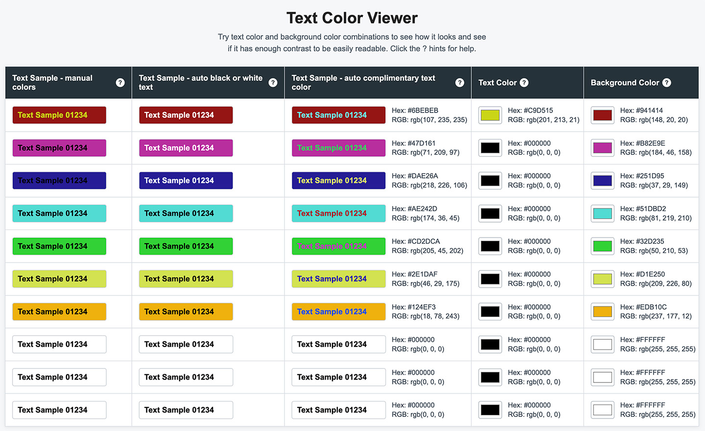

# Color Contrast
Try text color and background color combinations to see how it looks
and see if it has enough contrast to be easily readable.

[See a demo here](https://laurenra.github.io/color-contrast/).

## Use

This is a one-page app contained in a single HTML file. Download the
index.html file and open it in your browser.

## TODO
- [x] Add hints to the column headers.
- [x] Add a subheading that explains what this is.
- [ ] Another column that automatically calculates contrasting text color from the background color.
