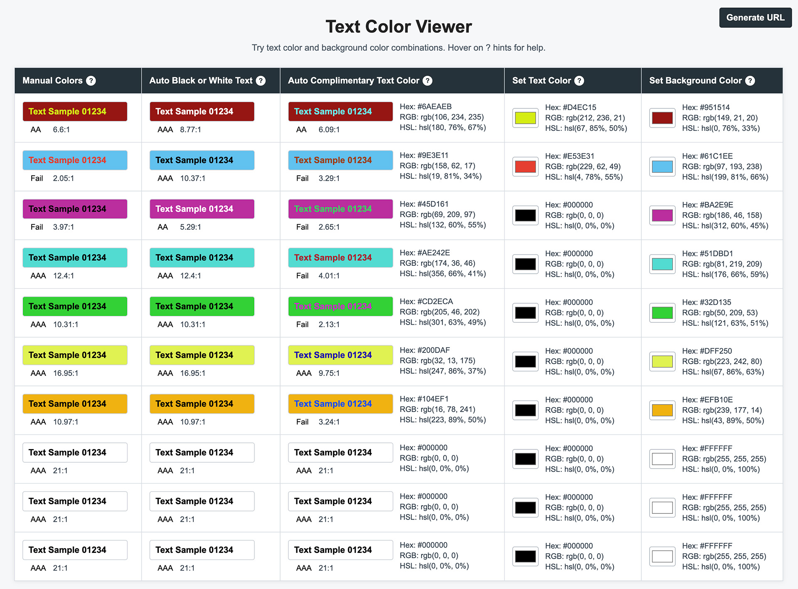

# Color Contrast
Try text color and background color combinations to see how it looks
and see if it has enough contrast to be easily readable.

[See a demo here](https://laurenra.github.io/color-contrast/).

## Use

This is a one-page app contained in a single HTML file. Download the
index.html file and open it in your browser.

Optional URL parameters can prefill row colors. Rows are zero-indexed:

- `r0txt=rgb(224-36-64)` sets row 1 text color ([try it](https://laurenra.github.io/color-contrast/?r0txt=rgb(224-36-64))).
- `r0bak=hsl(290-49pct-48pct)` sets row 1 background color ([try it](https://laurenra.github.io/color-contrast/?r0bak=hsl(290-49pct-48pct))).
- `r1txt=x0A8108` sets row 2 text color with hex, using `x` instead of `#` ([try it](https://laurenra.github.io/color-contrast/?r1txt=x0A8108)).

For a compact hex-friendly form, use `?r0=xB464C4~xEDF990` to set row 1
text and background colors together ([try it](https://laurenra.github.io/color-contrast/?r0=xB464C4~xEDF990)). Specific parameters like `r0txt`
or `r0bak` override the compact row value.

Use the Generate URL button to copy a URL for the current colors. It only
includes text colors that are not black and background colors that are not white.

To recreate the page in the sample image, [use this URL](https://laurenra.github.io/color-contrast/?r0txt=xD4EC15&r0bak=x951514&r1txt=xE53E31&r1bak=x61C1EE&r2bak=xBA2E9E&r3bak=x51DBD1&r4bak=x32D135&r5bak=xDFF250&r6bak=xEFB10E).
